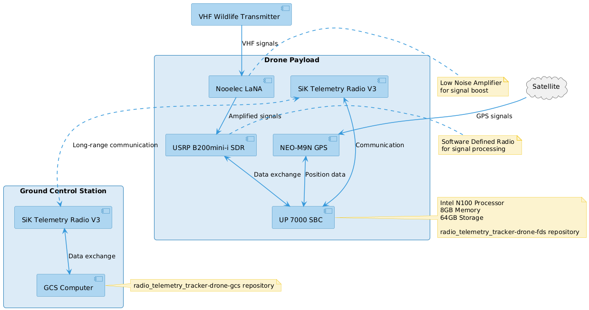
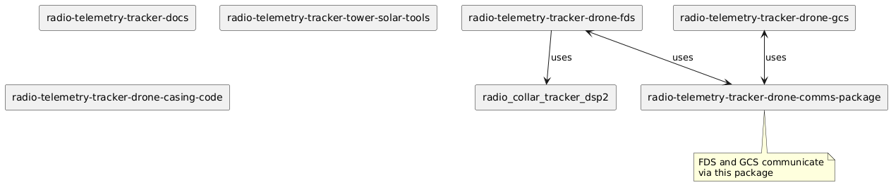

# Project Overview

Radio Telemetry Tracker (RTT) was established back in 2012 as an effort to track animals using radio telemetry. Traditional on-foot methods require researchers to trek through difficult terrain with unwieldy antennae, so a new drone-based system was developed to fly over an area in which animals equipped with transmitters can be found. An omni-directional antenna pointing downward beneath the drone picks up pings from the transmitters and sends that data back to a machine running our ground control station (GCS).

Recently, the project has been working on a new, tower-based system, in which several towers would be set up around a predetermined area and collect pings regularly throughout a deployment. Both the drone and tower systems are currently in development.

## Drone System Architecture

## Repository Structure

1. **[radio-telemetry-tracker-docs](https://github.com/UCSD-E4E/radio-telemetry-tracker-docs)**: Central project documentation and coordination

2. **[radio-telemetry-tracker-drone-comms-package](https://github.com/UCSD-E4E/radio-telemetry-tracker-drone-comms-package)**: Shared communication package for drone-related components

3. **[radio-telemetry-tracker-drone-fds](https://github.com/UCSD-E4E/radio-telemetry-tracker-drone-fds)**: Field Device Software for drone operations

4. **[radio-telemetry-tracker-drone-gcs](https://github.com/UCSD-E4E/radio-telemetry-tracker-drone-gcs)**: Ground Control Software for drone operations

5. **[radio_collar_tracker_dsp2](https://github.com/UCSD-E4E/radio_collar_tracker_dsp2)**: Digital Signal Processing package

6. **[radio-telemetry-tracker-tower-solar-tools](https://github.com/UCSD-E4E/radio-telemetry-tracker-tower-solar-tools)**: Tools for calculating optimal solar panel and battery configurations for the tower system

7. **[radio-telemetry-tracker-drone-casing-code](https://github.com/UCSD-E4E/radio-telemetry-tracker-drone-casing-code)**: CAD files for the drone casing

Each repository has its own README with more detailed information about its specific role and setup instructions.