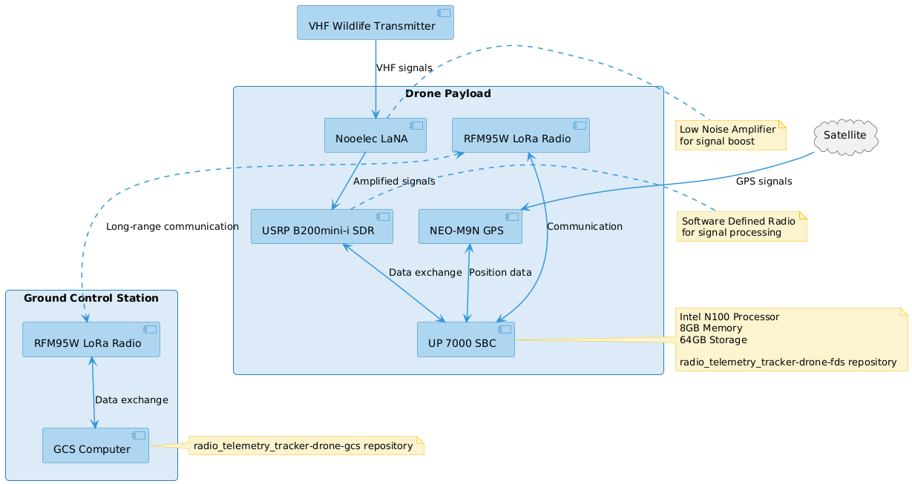

# Radio Telemetry Tracker Hardware Specifications

This document outlines the current hardware specifications for the Radio Telemetry Tracker project's drone system. These specifications are subject to change as the project evolves.

## Drone Payload

### **Single Board Computer**: UP 7000 (Intel N100, 8GB RAM, 64GB eMMC)
- [Product Link](https://up-shop.org/default/up-7000-series.html)

### **GPS + Compass**: SparkFun GPS Breakout - NEO-M9N
- [Product Link](https://mou.sr/3Pt2lmy)

### **Software Defined Radio**: USRP B200mini-i
- [Product Link](https://www.ettus.com/all-products/usrp-b200mini-i-2/)

### **Low Noise Amplifier**: Nooelec LaNA
- [Product Link](https://www.nooelec.com/store/lana.html?srsltid=AfmBOopzeX7KlBqEZARz0aIcDkEfL9iiwXlTAamh-N2XETJ2ykOVpHGz)

### **900 MHz Radio**: SiK Telemetry Radio V3
- [Product Link](https://www.sparkfun.com/products/19032)

## Additional Recommended Components

### Power Source
- DJI Skyport
- Extension Board

### Antennas
- It is recommended to use appropriate antennas where possible for both the drone payload and GCS to optimize signal reception and transmission.

Note: The specific models and types of these additional components may vary based on the exact requirements of the setup.
