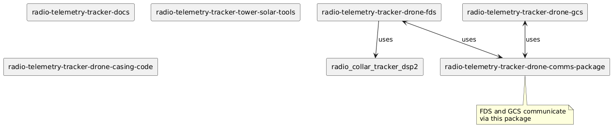

# Project Overview

Radio Telemetry Tracker (RTT) was established back in 2012 as an effort to track animals using radio telemetry. Traditional on-foot methods require researchers to trek through difficult terrain with unwieldy antennae, so a new drone-based system was developed to fly over an area in which animals equipped with transmitters can be found. An omni-directional antenna pointing downward beneath the drone picks up pings from the transmitters and sends that data back to a machine running our ground control station (GCS).

Recently, the project has been working on a new, tower-based system, in which several towers would be set up around a predetermined area and collect pings regularly throughout a deployment. Both the drone and tower systems are currently in development.

## Key Components

1. Drone Field Device Software (FDS)
2. Ground Control Software (GCS)
3. Communication Package
4. Digital Signal Processing (DSP) Package

## System Architecture

For more details on how these components interact, please see our [Repository Structure](repository-structure.md) document.

## References

The `references` directory contains bibliography files for project-related publications:

1. **project_publications.bib**: Contains citations for publications directly about the Radio Telemetry Tracker project.
2. **related_papers.bib**: Contains citations for papers related to the field of radio telemetry tracking but not specifically about this project.

These .bib files can be used with reference management software and LaTeX to easily cite relevant literature in project documentation and publications.