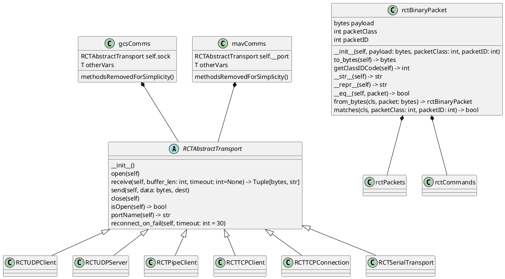

# RTT Comms Repository

Link to repo: https://github.com/UCSD-E4E/radio_collar_tracker_comms

The comms module contains low-level transport objects to provide basic transport functionality such as opening communications, sending and receiving data, and closing communications. Each transport object inherits from an abstract base class.

Comms also contains communication objects for our GCS and OBC to interface with appropriate transport objects in standard ways. By composing a comms object, we can set the GCS to a server (giving gcsComms a server object) and the OBC to a client (giving mavComms a client object) or vice versa. Our abstract base class guarantees the same core functionality will be present regardless.

Finally, comms contains packet types, which provide a standard structure to the data being sent and received, and several options specifying settings on the system peripherals (SDR, GPS, etc.).

### Testing
The comms repo contains pytest tests to confirm that transport objects can send and receive data correctly. Any newly-implemented transport types should be tested in a similar fashion.

### Visualization
puml for simplified overview of module (composition & extension of transports, generalized packet), as of Dec 2023 (throw into plantuml or similar to view diagram):
