# RTT GCS Repository

Link to repo: https://github.com/UCSD-E4E/radio_collar_tracker_gcs

Our Ground Control Station (GCS) module provides the code for our user interface. From this interface, the user can change software settings to reflect hardware status, connect to the system, and visualize pings from the system on a map, to name a few functions.

We use qgis to construct our UI. See the gcs repo's README for installation and environment setup instructions.

### Module Structure:
- `RctGcs`
  - `ui`
	  - `controls.py`: module providing additional controls for our UI to handle events, including creating collapsible fields and configuring system settings; functionality in this file should be targeted to handling data
		- `display.py`: module containing the logic for the actual display of our GCS UI, including our GCS class, which itself contains widgets including system status, system and configuration settings, and map control; functionality in this file should be targeted to creating the UI and handling user input
		- `map.py`: module containing tools to display and interact with a map within our GCS UI
		- `option_vars.py`: module defining option variables related to our DSP, GPS, SDR, and overall system
		- `popups.py`: module to create popup windows from our UI, including definitions of certain popups such as those to edit config settings, connect to our OBC, and add target frequencies, among others
	- `config.py`: module to provide global configuration structures for reading config file and storing and changing config variables
	- `droneSimulator.py`: module to simulate a drone as it completes a mission, for the purposes of testing local connection and the GCS's responses to simulated pings and other packets; see `drone_simulator.md` for more details on usage
	- `ping.py`: module specifying ping objects, including coordinates, timestamp, and signal characteristics, among other data, and performing operations with them
	- `rctCore.py`: module containing the GCS core model, including classes for the payload model, states, and events
	- `rctGcs.py`: script to show our GCS UI; this is the file to run to see our UI, but most changes you make will likely be to the files outlined above
- `gui_tests`: folder containing tests related to the GCS's qgis UI
- `tests`: folder containing tests to ensure configuration and imports are working as expected
- `gcsConfig.ini`: configuration file which can be modified directly or through the GCS UI

This does not cover all files in the repo but should serve as a whirlwind tour of some key pieces.

### Testing:
This module will need to be manually tested when making changes. Changes which are purely visual or deal only with local data may largely be tested by running `rctGCS.py`. However, more thorough testing involving connecting to and communicating with the system should be done before making any merges to the master branch. Here's a recommended outline of key functionality which should be tested (list is not exhaustive):

**GCS UI Tests**:
- In drone mode, can connect to drone, show 1 connection, and disconnect
- In tower mode, can connect to multiple towers, show correct number of connections, and disconnect
- Component statuses are accurate
- Can load map from file, cache, or web and plot drone, draw rectangles, and draw polygons on it
- While connected to drone/tower(s), can add targets, update them, and delete them
- Can edit config settings and have changes reflected in `gcsConfig.ini` after auto closure
- Can start/stop recording

**Simulator Tests**:
- In drone mode, simulator can host GCS, start, stop, and do_mission
- In tower mode, can connect multiple sockets to GCS, start, stop, and do_mission

### Visualization
puml for "simplified" view of this repo:

```plantuml
@startuml
frame config {
  enum ConnectionMode

  Configuration : str __connection_addr
  Configuration : int __connection_port
  Configuration : ConnectionMode __connection_mode
  Configuration <|-- ConnectionMode
}
frame ui {
  frame popups {
    ExpertSettingsDialog : __init__(self, parent, option_vars)
    ExpertSettingsDialog <|-- ExpertSettingsDialogPage

    ExpertSettingsDialogPage : UserPopups user_pops
    ExpertSettingsDialogPage : __init__(self, parent=None, option_vars=None)
    ExpertSettingsDialogPage : create_widget(self)
    ExpertSettingsDialogPage : validate_parameters(self)
    ExpertSettingsDialogPage : submit(self)
    ExpertSettingsDialogPage <|-- UserPopups

    AddTargetDialog : __init__(self, parent, center_frequency: int, sampling_frequency: int)
    AddTargetDialog : validate(self)
    AddTargetDialog : submit(self)
    AddTargetDialog : UserPopups user_pops
    AddTargetDialog : AddTargetDialogPage page
    AddTargetDialog <|-- UserPopups
    AddTargetDialog <|-- AddTargetDialogPage

    AddTargetDialogPage : __init__(self, parent, center_frequency: int, sampling_frequency: int)
    AddTargetDialogPage : __create_widget(self)

    ConnectionDialog : __init__(self, port_val, parent)
    ConnectionDialog : submit(self)
    ConnectionDialog : ConnectionDialogPage page
    ConnectionDialog <|-- ConnectionDialogPage

    ConnectionDialogPage : __init__(self, port_val, parent)
    ConnectionDialogPage : __create_widget(self)

    ConfigDialog : __init__(self, parent)
    ConfigDialog : submit(self)
    ConfigDialog : ConfigDialogPage page
    ConfigDialog : Configuration config
    ConfigDialog <|-- ConfigDialogPage
    ConfigDialog <|-- Configuration

    ConfigDialogPage : __init__(self, parent)
    ConfigDialogPage : __create_widget(self)
    ConfigDialogPage : UserPopups pop_up_box
    ConfigDialogPage <|-- UserPopups
  }
  frame controls {
    CollapseFrame : __init__(self, title="", parent=None)
    CollapseFrame : update_text(self, text)
    CollapseFrame : on_pressed(self)
    CollapseFrame : set_content_layout(self, layout)
    CollapseFrame : QWidget content_area
    CollapseFrame : QToolButton toggle_button
    CollapseFrame : QVBoxLayout lay

    CollapseFrame *-- SystemSettingsControl
  }
  frame display {
    GCS : Configuration config
    GCS : CollapseFrame _system_connection_tab
    GCS : CollapseFrame _config_tab
    GCS : UpgradeDisplay upgrade_display
    GCS : StatusDisplay status_widget
    GCS : MapControl map_control
    GCS : SystemSettingsControl system_settings_widget

    GCS <|-- Configuration
    GCS <|-- UpgradeDisplay
    GCS <|-- StatusDisplay
    GCS <|-- ComponentStatusDisplay
    GCS <|-- MapControl
    GCS <|-- UserPopups
    GCS <|-- CollapseFrame
    GCS <|-- SystemSettingsControl

    CollapseFrame *-- UpgradeDisplay
    CollapseFrame *-- StatusDisplay
    CollapseFrame *-- ComponentStatusDisplay
    CollapseFrame *-- MapControl
  }
  frame map {
    VehicleData : int ind
    VehicleData : Obj last_loc

    MapWidget : VehicleData vehicle_data
    MapWidget : PolygonMapTool tool_polygon
    MapWidget <|-- VehicleData
    MapWidget <|-- PolygonMapTool
    MapWidget <|-- VehicleData

    MapOptions : UserPopups user_pops
    MapOptions : CollapseFrame export_tab
    MapOptions : MapWidget map_widget
    MapOptions <|-- CollapseFrame
    MapOptions <|-- UserPopups
    MapOptions <|-- MapWidget

    MapWidget *-- WebMap
    WebMap : RectangleMapTool tool_rect
    WebMap <|-- RectangleMapTool

    MapWidget *-- StaticMap
  }
}
@enduml
```
