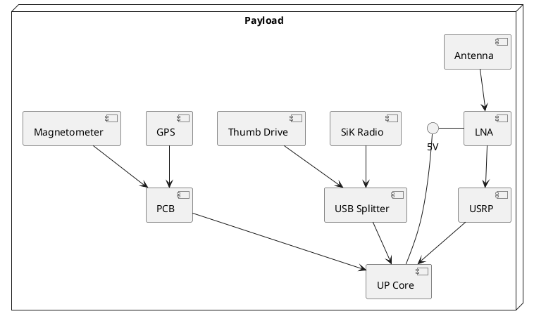

# Overview of System Electronics

- UP Core single-board computer
  - requires 5V 1500mA-4000mA power supply
- USRP B200mini software-defined radio (SDR)
  - Also connected to low-noise amplifier (LNA)
- NMEA GPS
- HMC-5983 magnetometer
- Communication device, ex:
	- WiFi antenna (or other comms)
	- SiK radio
- LEDs

puml for system, as of Dec 2023 (throw into plantuml to view diagram):
